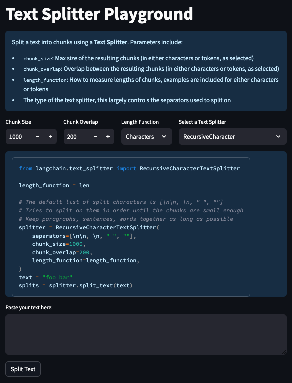

# Text Split Explorer



Many of the most important LLM applications involve connecting LLMs to external sources of data.
A prerequisite to doing this is to ingest data into a format where LLMs can easily connect to them.
Most of the time, that means ingesting data into a vectorstore.
A prerequisite to doing this is to split the original text into smaller chunks.

While this may seem trivial, it is a nuanced and overlooked step.
When splitting text, you want to ensure that each chunk has cohesive information - e.g. you don't just want to split in the middle of sentence.
What "cohesive information" means can differ depending on the text type as well.
For example, with Markdown you have section delimiters (`##`) so you may want to keep those together, while for splitting Python code you may want to keep all classes and methods together (if possible).

This repo (and associated Streamlit app) are designed to help explore different types of text splitting.
You can adjust different parameters and choose different types of splitters.
By pasting a text file, you can apply the splitter to that text and see the resulting splits.
You are also shown a code snippet that you can copy and use in your application

## Hosted App

To use the hosted app, head to [https://langchain-text-splitter.streamlit.app/](https://langchain-text-splitter.streamlit.app/)

## Running locally

To run locally, first set up the environment by cloning the repo and running:

```shell
pip install -r requirements.txt
```
如果你系统里有多个 Python 版本，建议用：
```
python3 -m venv venv
source venv/bin/activate  # mac/linux
.\venv\Scripts\Activate     # windows
pip install -r requirements.txt
```
win11报错禁止运行激活脚本，
```
Set-ExecutionPolicy -Scope Process -ExecutionPolicy Bypass
```
当前窗口有效，关掉 PowerShell 就恢复默认。安全性比较高

Then, run the Streamlit app with:

```shell
streamlit run splitter.py
```
## 报错问题解决
```
ERROR: Compiler cl cannot compile programs.
```
意思是：安装依赖（numpy）的时候，它需要 编译扩展模块，但找不到能正常用的 C 编译器（cl.exe）。这是 Windows 下 Python 项目常见的坑。
```
python -m pip install --upgrade pip setuptools wheel
```
手动安装核心库
```
pip install langchain textsplit streamlit
```
然后重装
```
pip install -r requirements.txt
```
运行起来后页面中央报错：
ModuleNotFoundError: No module named 'tiktoken'


核心原因就是：你运行的这个 **text-split-explorer** 项目里，用到了 **tiktoken** 这个库（它是 OpenAI 出的一个 tokenizer 库，用来数 token 的），但你本地环境还没装。

---

## 🔧 解决办法

在你的虚拟环境里装上 `tiktoken` 就行。

### 1. 进入 venv

如果你是在 **cmd** 里：

```cmd
C:\text-split-explorer\venv\Scripts\activate.bat
```

如果你在 **PowerShell**（且已设置 bypass）：

```powershell
.\venv\Scripts\Activate
```

---

### 2. 安装 tiktoken

```powershell
pip install tiktoken
```

> 如果下载太慢，可以用清华源：

```powershell
pip install tiktoken -i https://pypi.tuna.tsinghua.edu.cn/simple
```

---

### 3. 重新运行项目

通常这个项目是用 Streamlit 跑的：

```powershell
streamlit run splitter.py
```

---

## ⚡ 小贴士

1. `tiktoken` 有时会拉编译包，建议先升级 pip：

   ```powershell
   python -m pip install --upgrade pip
   ```

2. 如果还是报错，可以先单独试安装：

   ```powershell
   pip install --upgrade setuptools wheel
   pip install tiktoken
   ```

## 以管理员身份运行 PowerShell，然后执行，激活环境变量
   ```
Set-ExecutionPolicy RemoteSigned -Scope CurrentUser
.\venv\Scripts\Activate
   ```
## 运行命令
```
streamlit run splitter.py
```